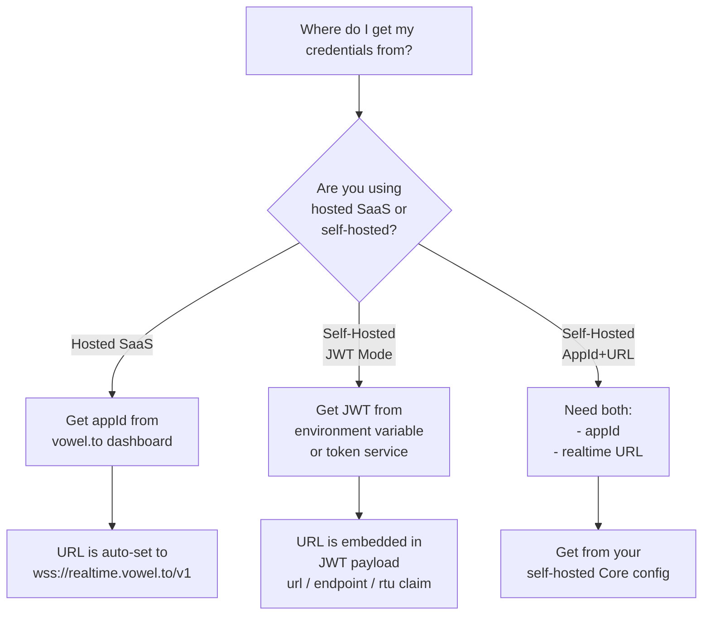
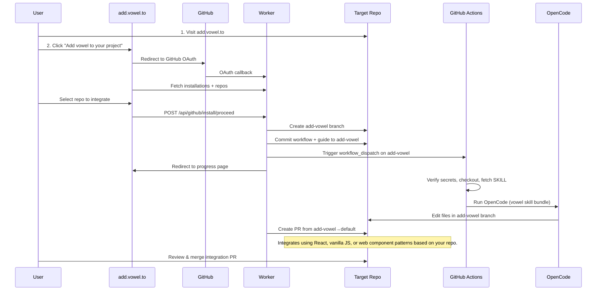
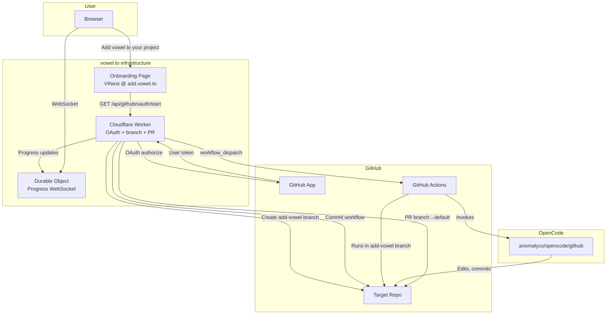

# voweldocs - Voice Agent for Documentation Sites

Add a voice AI agent to documentation sites, enabling users to navigate, search, and interact with docs using natural voice commands.

## When to Use This Skill

Use voweldocs when:

- You want to understand the pattern for voice-enabling documentation sites
- You want users to navigate pages via voice ("Go to installation guide")
- You want voice-controlled search ("Find the adapter documentation")
- You want to interact with page elements via voice ("Copy the first code example")
- You need automated route detection from markdown files

> **Note on Implementation**: This skill provides a **VitePress/Vue implementation** as a concrete example. See `vite-press.md` for complete VitePress-specific code. For other documentation frameworks, use the corresponding Vowel client skill:
> - **React (Docusaurus, Nextra)** → See `vowel-react` skill
> - **Astro (Starlight)** → See `vowel-webcomponent` skill
> - **Python/Rust/Go (MkDocs, Sphinx, mdBook, Hugo)** → See `vowel-webcomponent` skill (web component injection)
> - **Vanilla JS (Docsify, custom)** → See `vowel-vanilla` or `vowel-webcomponent` skill

## Prerequisites

- A documentation site (any static site generator that outputs HTML)
- A vowel.to account or self-hosted vowel stack
- Basic familiarity with Vowel client concepts
- Python with `uv` for RAG prebuild (optional, for semantic search)

## Gitignore Setup

When using the RAG prebuild feature, add these entries to `.gitignore` to exclude downloaded binaries and build state:

```gitignore
# RAG build artifacts - llama.cpp binaries and build state
scripts/llama-*/
scripts/.rag-build-state.yml
scripts/uv.lock
scripts/*.gguf
```

The generated `public/rag-index.yml` and `public/rag-documents.yml` should **not** be gitignored if you want pre-built embeddings in your repository. If you prefer to generate them during CI/CD, add:

```gitignore
# Uncomment to exclude pre-built RAG indices (generate in CI instead)
# public/rag-index.yml
# public/rag-documents.yml
```

## Configuration Decision Tree

Before setup, determine your credential source:



### Credential Summary

| Mode | Required | Source | URL Source |
|------|----------|--------|------------|
| Hosted | `appId` | vowel.to dashboard | Hardcoded: `wss://realtime.vowel.to/v1` |
| Self-hosted (JWT) | `jwt` | Token service or env var | Extracted from JWT payload (`url`/`endpoint`/`rtu` claim) |
| Self-hosted (Manual) | `appId` + `url` | Core configuration | Environment variable or config UI |

## Setup Overview

### Step 1: Install Dependencies

```bash
bun add @vowel.to/client @ricky0123/vad-web
```

### Step 2: Create Core Integration

The general pattern for voice-enabling a documentation site involves:

1. **Voice Client Module** - Initialize the Vowel client with documentation-specific actions
2. **Route Discovery** - Generate a manifest of available documentation pages
3. **Navigation Adapter** - Connect voice navigation to your router
4. **Configuration UI** - Allow users to enter credentials (AppId, JWT, or self-hosted URL)

### Step 3: Register Documentation Actions

Documentation sites typically implement these custom actions:

| Action | Purpose | Example Voice Command |
|--------|---------|----------------------|
| `searchDocs` | Trigger search UI | "Search for authentication" |
| `copyCodeExample` | Copy code blocks | "Copy the first code example" |
| `getCurrentPageInfo` | Read page structure | "What sections are on this page?" |
| `navigateToPage` | Route navigation | "Go to the installation guide" |

## Framework-Specific Implementations

### VitePress/Vue

See [vite-press.md](./vite-press.md) for the complete VitePress implementation including:
- Voice client initialization with Vue router
- Route generation plugin for Vite
- Configuration modal component
- Voice layout integration
- Custom actions for search and code copying

### React (Docusaurus, Nextra)

Use the `vowel-react` skill for React-based documentation sites.

### Web Component (Universal)

For all other frameworks (Starlight, MkDocs, Sphinx, mdBook, Hugo, Docsify, custom), use the `vowel-webcomponent` skill.

## URL Resolution Priority

When using self-hosted mode with JWT, the realtime URL is resolved in this order:

1. **JWT payload** (`url`, `endpoint`, or `rtu` claim)
2. **Environment variable** (`VITE_VOWEL_URL` or your framework's equivalent)
3. **Fallback placeholder** (your default self-hosted URL)

## Troubleshooting

| Issue | Solution |
|-------|----------|
| Routes not generated | Ensure route discovery runs during build/dev |
| Voice agent not initializing | Check browser console for credential validation errors |
| URL not detected from JWT | Verify JWT contains `url`, `endpoint`, or `rtu` claim |
| Microphone access denied | Requires HTTPS outside localhost |

## Framework Compatibility

Choose the appropriate Vowel client skill based on your documentation framework:

| Doc Framework | Language | Skill to Use | Notes |
|--------------|----------|--------------|-------|
| **React-based** ||||
| Docusaurus | React/MDX | `vowel-react` | Facebook-backed, excellent for large/open-source projects |
| Nextra | Next.js/React | `vowel-react` | Next.js-based, great for React/TS teams |
| **Vue-based** ||||
| VitePress | Vue/Vite | `voweldocs` (see vite-press.md) | Fast, Vite-powered, minimal config |
| VuePress | Vue | `vowel-webcomponent` | Classic Vue documentation generator |
| **Astro-based** ||||
| Starlight | Astro | `vowel-webcomponent` | Multi-framework, native web component support |
| **JavaScript-based** ||||
| Docsify | Vanilla JS | `vowel-vanilla` or `vowel-webcomponent` | Runtime rendering, inject via script tag |
| **Python-based** (via web component) ||||
| MkDocs + Material | Python | `vowel-webcomponent` | Inject via `extra_javascript` in `mkdocs.yml` |
| Sphinx | Python | `vowel-webcomponent` | Add to `html_js_files` in `conf.py` |
| **Go-based** (via web component) ||||
| Hugo | Go/Templates | `vowel-webcomponent` | Add script to base template or page footers |
| **Rust-based** (via web component) ||||
| mdBook | Rust | `vowel-webcomponent` | Add via `additional-js` in `book.toml` |
| **Other/Custom** ||||
| Vanilla JS/Custom | Any | `vowel-vanilla` | Plain HTML/JS documentation sites |
| Any Static Site | Any | `vowel-webcomponent` | Drop-in widget for any HTML output |

### Non-JS Framework Integration

All static site generators output HTML, so they can use the `vowel-webcomponent` skill:

**Python (MkDocs/Sphinx)**:
Add to your `mkdocs.yml` or `conf.py`:
```yaml
# mkdocs.yml (Material theme)
extra_javascript:
  - https://unpkg.com/@vowel.to/webcomponent@latest/dist/vowel-voice-widget.js
  - js/vowel-init.js  # Your initialization script
```

```python
# conf.py (Sphinx)
html_js_files = [
    'https://unpkg.com/@vowel.to/webcomponent@latest/dist/vowel-voice-widget.js',
    'vowel-init.js',
]
```

**Rust (mdBook)**:
```toml
# book.toml
[output.html]
additional-js = ["https://unpkg.com/@vowel.to/webcomponent@latest/dist/vowel-voice-widget.js", "vowel-init.js"]
```

**Go (Hugo)**:
Add to your base template (`layouts/partials/head.html` or `layouts/partials/footer.html`):
```html
<script src="https://unpkg.com/@vowel.to/webcomponent@latest/dist/vowel-voice-widget.js"></script>
```

## vowelbot Integration

<a href="https://youtu.be/lgs5OecnABU" style="display: block; position: relative; width: 50%; margin: 0 auto;">
  
  <div style="position: absolute; top: 50%; left: 50%; transform: translate(-50%, -50%); width: 80px; height: 80px; background: rgba(0,0,0,0.7); border-radius: 50%; display: flex; align-items: center; justify-content: center; pointer-events: none;">
    <svg viewBox="0 0 24 24" width="40" height="40" fill="white" style="margin-left: 4px;">
      <path d="M8 5v14l11-7z"/>
    </svg>
  </div>
</a>

**vowelbot** is a GitHub-integrated service that adds voice agent capabilities to web projects (React, vanilla JavaScript, or Web Components) via GitHub comments. Click the image above to watch the demo video.

### Overview

vowelbot enables automated voice integration for React, vanilla JavaScript, and Web Component projects through a branch-based onboarding flow:



### Quick Start

#### 1. API Keys (Optional)

vowelbot uses **OpenCode free models by default** — no setup required! The integration automatically uses high-quality free models (Minimax M2.5, Big Pickle, or Kimi K2.5).

**Want premium models?** Add one of these as a GitHub secret:

| Secret name | Where to get it |
|-------------|-----------------|
| `ANTHROPIC_API_KEY` | [console.anthropic.com](https://console.anthropic.com) — Claude models |
| `OPENAI_API_KEY` | [platform.openai.com](https://platform.openai.com) — GPT models |
| `GROQ_API_KEY` | [console.groq.com](https://console.groq.com) — Fast Llama models |
| `OPENCODE_API_KEY` | [opencode.ai/zen](https://opencode.ai/zen) — Use paid models with OpenCode credits |

**Where to add secrets:**

- **Organization:** Org → Settings → Secrets and variables → Actions → New organization secret
- **Single repo:** Repo → Settings → Secrets and variables → Actions → New repository secret

**Note:** If you add any API key, vowelbot will use that provider instead of the free OpenCode models.

#### 2. Integrate — One Click

Go to **[add.vowel.to](https://add.vowel.to)** and click **Add vowel to your project**. Choose the repo you want to integrate vowel into.

That's it. The workflow is added to your repo, the first integration runs automatically, and OpenCode opens a PR with voice agent changes tailored to your stack (React, vanilla JS, or `<vowel-voice-widget>`). Everything runs in one go — no manual re-run needed.

#### 3. Use It (Later Runs)

- **In an issue or PR:** Comment `/vowelbot integrate` (or `/vowelbot` + your request)
- **Manual run:** Actions → vowelbot integration → Run workflow

Your keys stay in your repo — vowelbot never sees them.

### What Gets Added

When you integrate, vowelbot adds:

- `.github/workflows/vowelbot-integrate.yml` — runs on `/vowelbot` comments and manual dispatch
- A setup guide in `docs/vowelbot-setup.md`

**Skill routing by target stack:**

- React/Next.js/TanStack Router/React Router: `vowel-react` skill
- Plain JavaScript (no framework): `vowel-vanilla` skill
- Drop-in widget integration: `vowel-webcomponent` skill

### Troubleshooting

| Issue | Solution |
|-------|----------|
| **Workflow fails with "no API key"** | This should not happen — vowelbot uses free OpenCode models by default. If you see this error, it may be a temporary issue with the free model provider. Try running the workflow again, or add an API key from Anthropic, OpenAI, or Groq as a fallback. |
| **Clicked integrate and workflow failed** | Go to Actions → vowelbot integration → Run workflow to retry. Free models may occasionally be unavailable during high demand — adding an API key ensures reliable access. |
| **"Project not compatible"** | Vowel supports React, vanilla JavaScript, and Web Components only. iOS Swift, Android, Flutter, and other non-web frameworks are not yet supported. |

### Architecture



**Key Architectural Principles:**

1. **Branch-based onboarding**: Create an **`add-vowel`** branch in the selected repository, commit workflow/setup files to that branch, run integration on that branch, then open a PR from `add-vowel` → default branch for review.

2. **Zero key custody**: User API keys stay in their repo secrets. vowelbot only uses GitHub App credentials.

3. **GitHub-native triggers**: After initial setup, `/vowelbot` comments trigger Actions directly — no persistent infrastructure in the hot path.

### Development Reference

For developers extending or debugging vowelbot:

**Project Structure:**

```
vowelbot/
├── .ai/                    # Planning documents
├── packages/
│   ├── worker/             # Cloudflare Worker (OAuth, branch, PR)
│   ├── onboarding/         # VINext app (add.vowel.to)
│   └── action/             # GitHub Action template
├── USAGE.md                # User-facing documentation
└── README.md               # Developer documentation
```

**Key Flows:**

| Flow | Description |
|------|-------------|
| **Onboarding** | User visits add.vowel.to → OAuth → repo selection → branch creation → workflow dispatch → OpenCode run → PR creation |
| **Later Runs** | `/vowelbot integrate` comment or manual Actions trigger — runs entirely in user's repo |

**Worker Routes:**

| Route | Method | Purpose |
|-------|--------|---------|
| `/api/github/oauth/start` | GET | Start OAuth flow; generates session, redirects to GitHub |
| `/api/github/oauth/callback` | GET | OAuth callback; exchange code for token |
| `/api/github/install/callback` | GET | GitHub App install callback; persist installation and return to repo picker |
| `/api/github/progress` | WebSocket | Durable Object for real-time progress |
| `/api/github/workflow-done` | POST | Workflow completion callback; create PR |

## References

- See `voweldocs/vite-press.md` for complete VitePress/Vue implementation
- See `vowel-react` skill for React-based documentation sites (Docusaurus, Nextra)
- See `vowel-vanilla` skill for vanilla JavaScript or Docsify setups  
- See `vowel-webcomponent` skill for Vue-based (VitePress, VuePress), Astro-based (Starlight), or any static site generator (MkDocs, Sphinx, mdBook, Hugo) via web component injection
- Visit [vowel.to](https://vowel.to) for hosted platform setup
- Watch the [vowelbot demo video](https://youtu.be/lgs5OecnABU) for a visual walkthrough
