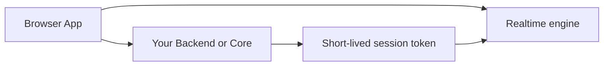

# Self-Hosted Architecture

The self-hosted stack separates control-plane responsibilities from realtime session execution.

## Core Components

The self-hosted deployment has two primary services:

- **Core**: the control plane and token service
- **Realtime engine**: the service that runs live voice sessions

## High-Level Flow

## Responsibilities

### Core

Core is responsible for:

- app configuration
- issuing short-lived session credentials
- managing the settings that shape session startup

### Realtime Engine

The realtime engine is responsible for:

- accepting authenticated realtime connections
- managing live voice sessions
- coordinating model, speech, and tool execution

## Operator Responsibilities

When you self-host, your team is responsible for:

- infrastructure and network access
- environment and secret management
- provider credentials
- service health and deployment lifecycle

## When To Choose Self-Hosted

Choose self-hosted when you need:

- infrastructure control
- custom token issuance or backend policy
- self-managed deployment and networking
- separation between your app backend and the hosted platform
