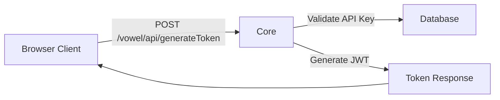
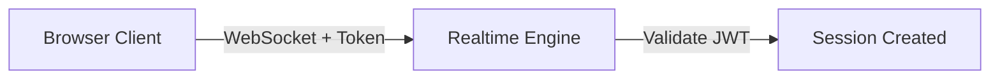

# Self-Hosted Core

Core is the control plane for the self-hosted stack. It provides token issuance, app management, and a Web UI for configuring your self-hosted deployment.

## What Core Does

Core is responsible for:

- App and session configuration
- Issuing short-lived session tokens
- Holding the configuration used when sessions are created
- Providing the browser-facing or backend-facing token entry point
- Encrypting and storing provider API keys
- Managing publishable API keys for client authentication

## API Endpoints

### Health Check

```bash
GET http://localhost:3000/health
```

Response:
```json
{
  "status": "ok"
}
```

### Token Generation

The primary endpoint for client applications to request ephemeral tokens.

```bash
POST http://localhost:3000/vowel/api/generateToken
```

**Headers:**
- `Content-Type: application/json`
- `X-API-Key: vkey_your_bootstrap_publishable_key`

**Request Body:**
```json
{
  "appId": "default",
  "provider": "vowel-prime",
  "language": "en-US",
  "initialGreetingPrompt": "Hello! How can I help you today?"
}
```

**Response:**
```json
{
  "token": "ek_eyJhbGciOiJIUzI1NiIs...",
  "expiresAt": "2024-01-15T10:30:00Z",
  "wsUrl": "ws://localhost:8787/v1/realtime"
}
```

**Example curl:**
```bash
curl -X POST http://localhost:3000/vowel/api/generateToken \
  -H "Content-Type: application/json" \
  -H "X-API-Key: vkey_your_bootstrap_publishable_key" \
  -d '{
    "appId": "default",
    "provider": "vowel-prime"
  }'
```

### Web UI

Core provides a web interface for managing apps and API keys:

```
http://localhost:3000
```

The Web UI allows you to:
- Create and manage apps
- Generate and revoke API keys
- View token usage statistics
- Configure endpoint presets

## Bootstrap Process

On first boot, Core automatically creates an app and publishable API key based on environment variables in `stack.env`:

1. **App Creation**: Creates an app with ID from `CORE_BOOTSTRAP_APP_ID`
2. **API Key Generation**: Creates a publishable key from `CORE_BOOTSTRAP_PUBLISHABLE_KEY`
3. **Endpoint Preset**: Configures the engine endpoint for the `staging` preset

**Verify Bootstrap:**
```bash
bun run stack:logs | grep bootstrap
```

Expected output:
```
[core] bootstrap publishable key created for app=default
```

**Bootstrap Configuration Variables:**

| Variable | Default | Purpose |
|----------|---------|---------|
| `CORE_BOOTSTRAP_APP_ID` | `default` | App identifier |
| `CORE_BOOTSTRAP_APP_NAME` | `Local Stack App` | Display name |
| `CORE_BOOTSTRAP_PUBLISHABLE_KEY` | - | API key value (64 char hex with `vkey_` prefix) |
| `CORE_BOOTSTRAP_SCOPES` | `mint_ephemeral` | Key capabilities |

## Token Flow

### 1. Client Requests Token



### 2. Client Connects to Engine



## When You Interact With Core

You interact with Core when you need to:

- Configure a self-hosted app
- Request a session token
- Control how new sessions are initialized
- Manage API keys and their scopes
- View app configuration and usage

In many deployments, the browser does not talk directly to the realtime engine first. It fetches a token from Core or from your backend, then uses that token to start the live session.

## How Core Fits Into The Flow

1. Your app or backend requests a session token from Core
2. Core validates the publishable API key and app permissions
3. Core generates a short-lived JWT token (5-minute expiration)
4. Core returns the token and WebSocket URL
5. The client connects to the realtime engine with that token
6. The engine validates the JWT and starts the session

## Configuration Reference

### Core Environment Variables

Core reads these environment variables from `stack.env`:

**Required:**
- `ENCRYPTION_KEY`: For encrypting stored API keys
- `ENGINE_URL`: Internal URL to reach engine (`http://engine:8787`)
- `ENGINE_WS_URL`: External WebSocket URL for clients
- `ENGINE_API_KEY`: Shared secret with engine

**Optional:**
- `DB_PATH`: SQLite database location (`/app/data/core.db`)
- `PORT`: Service port (default: 3000)
- `OPENAI_API_KEY`: For OpenAI provider (if using)
- `XAI_API_KEY`: For xAI provider (if using)

### Endpoint Presets

Core supports multiple engine endpoint presets for different environments:

```bash
ENDPOINT_PRESET_VOWEL_PRIME_STAGING_HTTP_URL=http://engine:8787
ENDPOINT_PRESET_VOWEL_PRIME_STAGING_WS_URL=ws://localhost:8787/v1/realtime
```

## Demo Application Connection

To connect the demo application to your self-hosted Core:

### 1. Configure Demo Environment

Create `demos/demo/.env.local`:

```bash
VITE_USE_CORE_COMPOSE=1
VITE_CORE_BASE_URL=http://localhost:3000
VITE_CORE_TOKEN_ENDPOINT=http://localhost:3000/vowel/api/generateToken
VITE_CORE_API_KEY=vkey_your_bootstrap_publishable_key
VITE_CORE_APP_ID=default
```

### 2. Start the Demo

```bash
cd demos/demo
bun run dev
```

### 3. Test the Connection

1. Open the demo URL (usually `http://localhost:5173`)
2. Click the microphone button
3. Speak - the demo should connect to Core, get a token, then connect to the engine

### Demo Configuration Values

| Variable | Value | Source |
|----------|-------|--------|
| `VITE_CORE_BASE_URL` | `http://localhost:3000` | `CORE_HOST_PORT` from stack.env |
| `VITE_CORE_API_KEY` | Your bootstrap key | `CORE_BOOTSTRAP_PUBLISHABLE_KEY` |
| `VITE_CORE_APP_ID` | `default` | `CORE_BOOTSTRAP_APP_ID` |

## What Core Does Not Replace

Core is not the realtime runtime itself. It does not:
- Process audio streams
- Run voice activity detection
- Execute speech-to-text or text-to-speech
- Handle WebSocket connections
- Run the AI model inference

That role belongs to the [realtime engine](./engine).

## Source Repository

Core is open source at [github.com/usevowel/core](https://github.com/usevowel/core).

## Next Steps

- [Architecture](./architecture) - Understand how Core fits in the stack
- [Realtime Engine](./engine) - Learn about the voice runtime
- [Configuration](./configuration) - Configure environment variables
- [Deployment](./deployment) - Deploy the full stack
- [Troubleshooting](./troubleshooting) - Debug common issues
