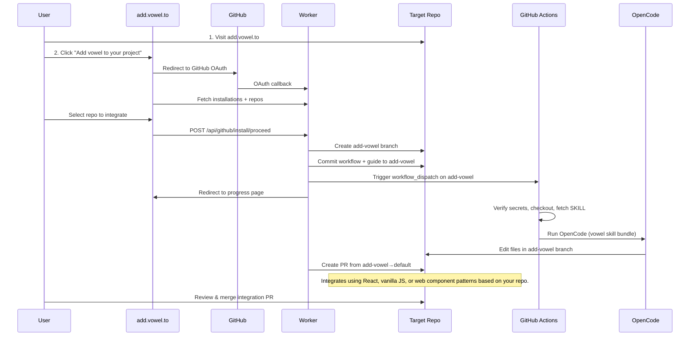
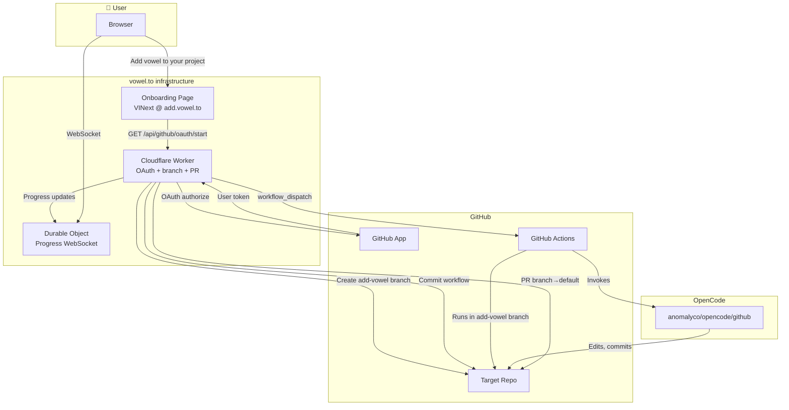

# vowelbot

<a href="https://youtu.be/lgs5OecnABU" style="display: block; position: relative; width: 50%; margin: 0 auto;">
  
  

    <svg viewBox="0 0 24 24" width="40" height="40" fill="white" style="margin-left: 4px;">
      <path d="M8 5v14l11-7z"/>
    </svg>
  

</a>

[**vowelbot**](https://vowel.to/vowelbot) is a GitHub-integrated service that adds voice agent capabilities to web projects (React, vanilla JavaScript, or Web Components) via GitHub comments. Click the image above to watch the demo video.

Use `vowelbot` to add vowel to a GitHub repository with an **automatic** onboarding flow at [add.vowel.to](https://add.vowel.to). Just click a button — the integration runs entirely in an isolated branch, leaving your existing work pristine.

## Supported Projects

- **Supported:** React, vanilla JavaScript, Web Components (web projects only)
- **Not yet supported:** iOS Swift, Android, Flutter, and other non-web frameworks

## Quick Start

### 1. API Keys (Optional)

vowelbot uses **[OpenCode](https://opencode.ai/) directly inside the GitHub action** — no setup required! The integration automatically uses high-quality free models (Minimax M2.5, Big Pickle, or Kimi K2.5).

**Want premium models?** Add one of these as a GitHub secret:

| Secret name | Where to get it |
|-------------|-----------------|
| `ANTHROPIC_API_KEY` | [console.anthropic.com](https://console.anthropic.com) — Claude models |
| `OPENAI_API_KEY` | [platform.openai.com](https://platform.openai.com) — GPT models |
| `GROQ_API_KEY` | [console.groq.com](https://console.groq.com) — Fast Llama models |
| `OPENCODE_API_KEY` | [opencode.ai/zen](https://opencode.ai/zen) — Use paid models with OpenCode credits |

**Where to add secrets:**

- **Organization:** Org → Settings → Secrets and variables → Actions → New organization secret
- **Single repo:** Repo → Settings → Secrets and variables → Actions → New repository secret

**Note:** If you add any API key, vowelbot will use that provider instead of the free [OpenCode](https://opencode.ai/) models.

### 2. Integrate — One Click

Go to **[add.vowel.to](https://add.vowel.to)** and click **Add vowel to your project**. Choose the repo you want to integrate vowel into.

That's it. The workflow is added to your repo, the first integration runs automatically, and OpenCode opens a PR with voice agent changes tailored to your stack (React, vanilla JS, or `<vowel-voice-widget>`). Everything runs in one go — no manual re-run needed.

**Your existing code stays untouched.** The integration uses [agent skills from the vowel repository](https://github.com/usevowel/skills/tree/main/skills) — [`vowel-react`](https://github.com/usevowel/skills/tree/main/skills/vowel-react), [`vowel-vanilla`](https://github.com/usevowel/skills/tree/main/skills/vowel-vanilla), [`vowel-webcomponent`](https://github.com/usevowel/skills/tree/main/skills/vowel-webcomponent), or [`voweldocs`](https://github.com/usevowel/skills/tree/main/skills/voweldocs) — selected automatically based on your project type.

During setup, vowelbot creates an isolated **`add-vowel`** branch in your repository. All workflow setup, integration logic, and voice agent changes are committed to this branch only. When complete, it opens a pull request from the `add-vowel` branch to your default branch for you to review and merge. Your existing branches and work remain completely untouched until you choose to merge.

### 3. Use It (Later Runs)

- **In an issue or PR:** Comment `/vowelbot integrate` (or `/vowelbot` + your request)
- **Manual run:** Actions → vowelbot integration → Run workflow

Your keys stay in your repo — vowelbot never sees them.

### GitHub Codespaces

No additional setup required — when the OpenCode agent integrates vowel into your repository, a [GitHub Codespaces](https://github.com/codespaces/new?repo=usevowel/skills) environment is automatically configured for testing.

You can also explore the skills directly in GitHub Codespaces: 

## Troubleshooting

| Issue | Solution |
|-------|----------|
| **Workflow fails with "no API key"** | This should not happen — vowelbot uses free [OpenCode](https://opencode.ai/) models by default. If you see this error, it may be a temporary issue with the free model provider. Try running the workflow again, or add an API key from Anthropic, OpenAI, or Groq as a fallback. |
| **Clicked integrate and workflow failed** | Go to Actions → vowelbot integration → Run workflow to retry. Free models may occasionally be unavailable during high demand — adding an API key ensures reliable access. |
| **"Project not compatible"** | Vowel supports React, vanilla JavaScript, and Web Components only. iOS Swift, Android, Flutter, and other non-web frameworks are not yet supported. |

## Onboarding Flow

## Architecture

### Key Architectural Principles

1. **Branch-based onboarding (pristine)**: All changes happen in an isolated `add-vowel` branch. Your existing branches, default branch, and working code remain completely untouched. The integration runs entirely within this branch, then opens a PR for your review. Nothing changes in your repository until you explicitly merge.

2. **Zero key custody**: User API keys stay in their repo secrets. We only use GitHub App credentials.

3. **GitHub-native triggers**: After initial setup, `/vowelbot` comments trigger Actions directly — no persistent infrastructure in the hot path.

## Reference

- Watch the [vowelbot demo video](https://youtu.be/lgs5OecnABU) for a visual walkthrough
- Visit [add.vowel.to](https://add.vowel.to) to start integrating
