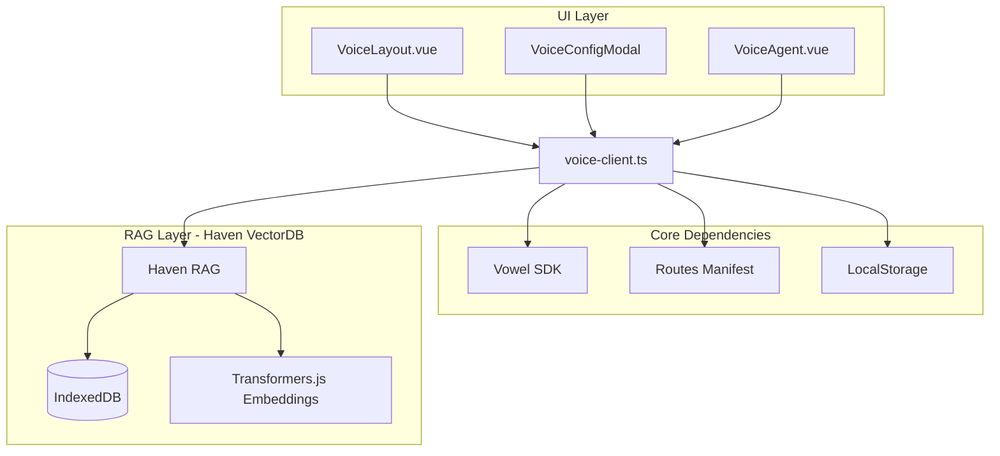
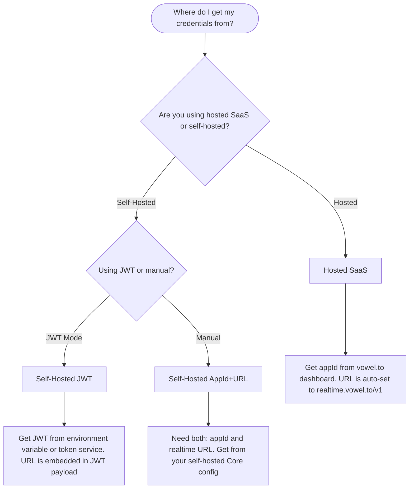

# voweldocs - Voice Agent for Documentation Sites

This document explains how the vowel client is integrated into this VitePress documentation site, enabling voice-powered navigation and interaction for documentation users.

## What is voweldocs?

**voweldocs** is a reference implementation showing how to add a voice AI agent to any documentation site. Users can:

- Navigate pages using voice commands ("Take me to the installation guide")
- Ask questions about the content with RAG-powered answers ("What is Vowel?")
- Get AI responses grounded in your documentation via semantic search
- Interact with page elements ("Copy the first code example")
- Search documentation with VitePress DocSearch ("Search for adapters")

## Architecture Overview



## Key Components

### 1. VoiceLayout.vue
Custom VitePress theme layout that:
- Adds a "voweldocs" button to the navbar
- Shows voice configuration modal
- Mounts the voice agent widget
- Handles configuration state

### 2. VoiceConfigModal.vue
Configuration UI supporting two modes:
- **Hosted (SaaS)**: Uses `appId` from [vowel.to](https://vowel.to) with hardcoded realtime URL
- **Self-Hosted**: Uses either:
  - `appId` + `url` (manual configuration)
  - JWT token with embedded URL (from environment variable)


**How users get voice access:**

There are two ways users can start using voice navigation on your docs:

### Pre-configured Mode (No User Input Required)

If you provide credentials via environment variables at build time (`VITE_VOWEL_APP_ID`, `VITE_VOWEL_URL`, `VITE_VOWEL_JWT_TOKEN`), the voice agent initializes automatically. Users can start speaking immediately without any configuration - the "voweldocs" button simply opens/closes the voice interface.

This is ideal for:
- SaaS documentation where you want zero-friction voice access
- Internal documentation with a shared self-hosted instance
- Any site where you want to provide voice out-of-the-box

### User-Configured Mode (Bring Your Own Credentials)

If no credentials are pre-configured via environment variables, clicking the "voweldocs" button opens the configuration modal where users enter their own credentials:

1. **Hosted Mode** - Users enter their `appId` from [vowel.to](https://vowel.to/dashboard):
   - Sign up at vowel.to and create an app in the dashboard
   - Copy the `appId` and paste it into the "App ID" field
   - The realtime URL is automatically set to `wss://realtime.vowel.to/v1`
   - Click "Save Configuration" to activate voice navigation

2. **Self-Hosted (Manual)** - For users running their own vowel infrastructure:
   - Enter the `appId` from your self-hosted Core configuration
   - Enter your custom realtime endpoint URL (e.g., `wss://your-domain.com/realtime`)
   - Save to connect to your private instance

3. **Self-Hosted (JWT)** - For production self-hosted deployments:
   - Enable JWT mode to use a token with embedded URL
   - Enter or paste a JWT token (can be pre-filled via `VITE_VOWEL_JWT_TOKEN` env var)
   - The URL is extracted automatically from the JWT payload

**Storage:** Credentials are stored in browser localStorage (per-user, per-device) and the voice agent initializes immediately after saving.

### 3. voice-client.ts
Core initialization logic:
- Reads credentials from localStorage
- Builds Vowel configuration based on mode
- Registers documentation-specific actions:
  - `searchKnowledgeBase` - **RAG-powered semantic search** over docs (Haven VectorDB)
  - `searchDocs` - Trigger DocSearch
  - `getCurrentPageInfo` - Read page structure
  - `copyCodeExample` - Copy code blocks
  - `jumpToSection` - Scroll to headings
  - `listSections` - Enumerate page sections
  - `showRelatedPages` - Find related docs
  - `openRagDebugChat` - Open debug panel to see STT/RAG results

### 4. Routes Manifest (Auto-generated)
The `generate-routes-plugin.ts` Vite plugin scans all markdown files at build time and generates `routes-manifest.ts` with page paths and descriptions for voice navigation.

### 5. RAG Knowledge Base (Haven VectorDB)
Powered by [Haven](https://github.com/kyrillosishak/Haven) - a privacy-first vector database that runs entirely in the browser:
- **Local semantic search** using Transformers.js embeddings
- **Pre-built index** loaded from `rag-index.yml` (generated at build time)
- **Zero cloud dependencies** - all processing happens client-side via WebAssembly
- **Instant answers** - the AI searches your docs before responding, ensuring factual, grounded answers
- **Debug visibility** - RAG debug chat shows exactly what the AI retrieved


## Configuration Decision Tree

When setting up voweldocs for your documentation project, use this decision tree to determine which credentials you need:



### Environment Variables Reference

Create a `.env` file (see `.env.example`):

| Variable | Mode | Purpose |
|----------|------|---------|
| `VITE_VOWEL_APP_ID` | Hosted | Your app ID from vowel.to |
| `VITE_VOWEL_URL` | Self-hosted | Your realtime endpoint (e.g., `wss://your-instance.com/realtime`) |
| `VITE_VOWEL_USE_JWT` | Self-hosted | Set to `true` to enable JWT mode |
| `VITE_VOWEL_JWT_TOKEN` | Self-hosted | JWT token with embedded URL |
| `VITE_VOWEL_DEBUG_RAG` | Dev only | Set to `true` to enable RAG debug UI (shows STT transcripts + search results) |

### URL Resolution Priority (Self-Hosted)

When using self-hosted mode, the realtime URL is resolved in this order:

1. **JWT payload** (`url`, `endpoint`, or `rtu` claim) - Highest priority
2. **Environment variable** (`VITE_VOWEL_URL`)
3. **Fallback placeholder** - Only used if neither above is set

## RAG Knowledge Base

The voice agent includes a **privacy-first RAG (Retrieval-Augmented Generation)** system powered by [Haven](https://github.com/kyrillosishak/Haven), a local vector database that runs entirely in the browser.

### How It Works

1. **Build-time indexing**: A pre-built index is generated from all documentation at build time
2. **Local embeddings**: Uses Transformers.js with Xenova/all-MiniLM-L6-v2 for fast, local semantic embeddings
3. **Semantic search**: When the user asks a question, the AI first searches the knowledge base for relevant docs
4. **Grounded responses**: The AI formulates answers based on retrieved context, ensuring factual accuracy

### Key Features

- **Zero cloud costs**: No API calls or external services for search
- **Privacy-preserving**: All data stays in the browser's IndexedDB
- **Offline-capable**: Works without internet after initial page load
- **Instant responses**: ~50ms search latency for 10K+ documents
- **Source citations**: The AI can reference specific documentation pages

### Debug Mode

Set `VITE_VOWEL_DEBUG_RAG=true` to enable a debug panel that shows:
- Real-time STT (speech-to-text) transcripts
- RAG search queries and retrieved documents
- Confidence scores and source paths

Users can also say "Open the debug chat" to see this panel.


### RAG Files Structure

The following diagram shows how documentation files are processed and prepared for the pre-embedded RAG index:


**How files get pre-embedded:**

1. **Source Documentation** - All `.md` files in the docs directory are scanned at build time
2. **Chunking** - Content is split into semantic chunks (paragraphs, sections) with configurable overlap
3. **Embedding Generation** - Each chunk is processed through `llama.cpp` with Vulkan GPU acceleration (or CPU fallback) using the `all-MiniLM-L6-v2` model
4. **Index Output** - The `scripts/build-rag.py` script generates `public/rag-index.yml` containing:
   - Original text chunks
   - 384-dimensional vector embeddings
   - Source file paths and section metadata
   - Search index optimized for Haven VectorDB

When the voice client initializes, it loads this pre-built index directly into Haven's browser-based VectorDB, enabling instant semantic search without any server-side processing or API calls.

## For Other Documentation Projects

To adapt voweldocs for your own documentation site:

### 1. Install Dependencies

```bash
bun add @vowel.to/client @ricky0123/vad-web haven
```

The `haven` package provides the local vector database for RAG functionality.

### 2. Copy Core Files

Copy these files from the voweldocs reference implementation:
- `.vitepress/theme/voice-client.ts` - Core client logic (includes RAG actions)
- `.vitepress/theme/VoiceLayout.vue` - Layout wrapper
- `.vitepress/theme/VoiceConfigModal.vue` - Configuration UI
- `.vitepress/theme/VoiceAgent.vue` - React wrapper component
- `.vitepress/theme/VoiceAgentWrapper.tsx` - React integration
- `.vitepress/theme/generate-routes-plugin.ts` - Route generation
- `.vitepress/theme/prebuilt-rag.ts` - Haven VectorDB initialization for local RAG
- `.vitepress/theme/rag-debug/` - Debug UI for viewing STT/RAG results (optional)

### 3. Configure VitePress Theme

Update `.vitepress/theme/index.ts`:

```typescript
import { generateRoutesPlugin } from './generate-routes-plugin'

export default {
  extends: DefaultTheme,
  Layout: VoiceLayout, // Your custom layout
  enhanceApp({ app, router, siteData }) {
    // ... other enhancements
  }
}
```

### 4. Add Route Generation Plugin

Update `vite.config.ts`:

```typescript
import { generateRoutesPlugin } from './.vitepress/theme/generate-routes-plugin'

export default defineConfig({
  plugins: [
    generateRoutesPlugin(),
    // ... other plugins
  ]
})
```

### 5. Configure Environment

Create `.env` based on your chosen mode (see decision tree above).

### 6. Generate RAG Index (Optional but Recommended)

For AI-powered answers grounded in your documentation, generate the pre-built embedding index:

```bash
# Generate RAG embeddings using llama.cpp with Vulkan acceleration
# This creates public/rag-index.yml with pre-computed embeddings for Haven VectorDB
bun run build:rag
```

This script (`scripts/build-rag.py`):
- Processes all markdown documentation files
- Chunks content into searchable segments
- Generates embeddings using llama.cpp with Vulkan GPU acceleration (falls back to CPU if no Vulkan)
- Outputs `public/rag-index.yml` ready for Haven VectorDB

For full production build (includes RAG + routes + VitePress):

```bash
bun run docs:build
```

The build process generates:
- `routes-manifest.ts` - Navigation routes for voice commands
- `public/rag-index.yml` - Pre-computed embeddings for semantic search

### 7. Customize Actions

Edit `voice-client.ts` to register documentation-specific actions for your content:

```typescript
vowel.registerAction(
  'myCustomAction',
  {
    description: 'Does something specific to my docs',
    parameters: { /* ... */ }
  },
  async (params) => {
    // Implementation
  }
)
```

## Security Considerations

- Credentials are stored in browser localStorage (per-user, not shared)
- App IDs and JWTs should be treated as sensitive tokens
- JWT mode is recommended for production self-hosted deployments
- Environment variables are only used for pre-filling the UI, not for server-side rendering

## Troubleshooting

| Issue | Solution |
|-------|----------|
| Voice agent not appearing | Check browser console for initialization errors |
| "No voice configuration found" | Click the voweldocs button and configure credentials |
| JWT URL not detected | Verify JWT format (should have `url`, `endpoint`, or `rtu` claim) |
| Navigation not working | Check that routes-manifest.ts is generated (run build) |
| Microphone not working | Ensure HTTPS (required outside localhost) |
| AI answers seem wrong | Enable RAG debug (`VITE_VOWEL_DEBUG_RAG=true`) to see what docs were retrieved |
| RAG not finding results | Check that `rag-index.yml` exists in `public/` and was generated at build time |

## Agent Skills

When working with this codebase in Cursor/Claude, these agent skills provide detailed guidance:

| Skill | Location | Purpose |
|-------|----------|---------|
| `voweldocs` | `.agents/skills/voweldocs/` | Main pattern for voice-enabling documentation sites (VitePress/Vue implementation) |
| `rag-prebuild` | `.agents/skills/rag-prebuild/` | Pre-build RAG embeddings with `scripts/build-rag.py` |
| `haven-local-rag` | `.agents/skills/haven-local-rag/` | Haven VectorDB, browser-based semantic search, local RAG pipelines |

## Further Reading

- [Vowel Client Guide](/guide/vowel-client)
- [React Integration](/guide/react)
- [Self-Hosted Stack](/self-hosted/)
- [Haven VectorDB](https://github.com/kyrillosishak/Haven) - Privacy-first browser-based RAG
- [vowel.to Platform](https://vowel.to)
