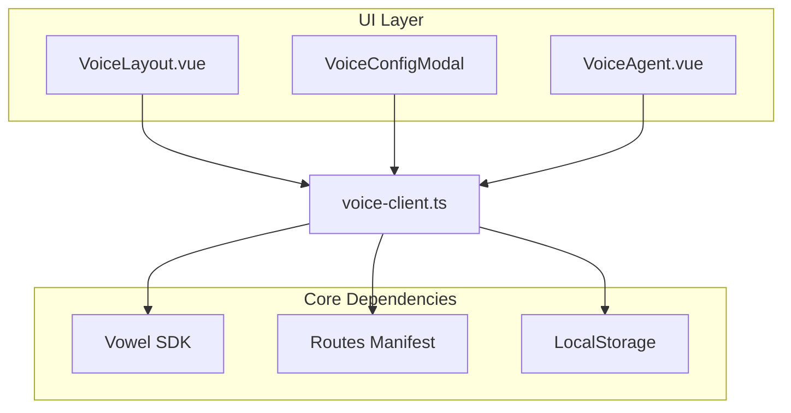
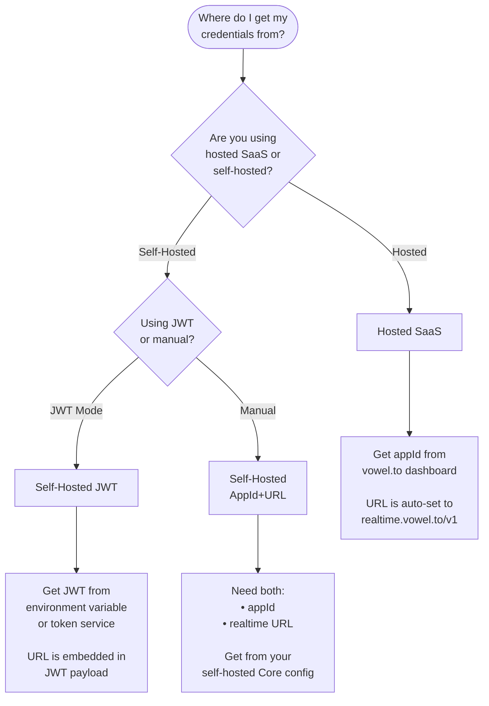

# voweldocs - Voice Agent for Documentation Sites

This document explains how the vowel client is integrated into this VitePress documentation site, enabling voice-powered navigation and interaction for documentation users.

## What is voweldocs?

**voweldocs** is a reference implementation showing how to add a voice AI agent to any documentation site. Users can:

- Navigate pages using voice commands ("Take me to the installation guide")
- Search documentation ("Search for adapters")
- Interact with page elements ("Copy the first code example")
- Ask questions about the content ("What is Vowel?")

## Architecture Overview



## Key Components

### 1. VoiceLayout.vue
Custom VitePress theme layout that:
- Adds a "voweldocs" button to the navbar
- Shows voice configuration modal
- Mounts the voice agent widget
- Handles configuration state

### 2. VoiceConfigModal.vue
Configuration UI supporting two modes:
- **Hosted (SaaS)**: Uses `appId` from [vowel.to](https://vowel.to) with hardcoded realtime URL
- **Self-Hosted**: Uses either:
  - `appId` + `url` (manual configuration)
  - JWT token with embedded URL (from environment variable)

### 3. voice-client.ts
Core initialization logic:
- Reads credentials from localStorage
- Builds Vowel configuration based on mode
- Registers documentation-specific actions:
  - `searchDocs` - Trigger DocSearch
  - `getCurrentPageInfo` - Read page structure
  - `copyCodeExample` - Copy code blocks
  - `jumpToSection` - Scroll to headings
  - `listSections` - Enumerate page sections
  - `showRelatedPages` - Find related docs

### 4. Routes Manifest (Auto-generated)
The `generate-routes-plugin.ts` Vite plugin scans all markdown files at build time and generates `routes-manifest.ts` with page paths and descriptions for voice navigation.

## Configuration Decision Tree

When setting up voweldocs for your documentation project, use this decision tree to determine which credentials you need:



### Environment Variables Reference

Create a `.env` file (see `.env.example`):

| Variable | Mode | Purpose |
|----------|------|---------|
| `VITE_VOWEL_APP_ID` | Hosted | Your app ID from vowel.to |
| `VITE_VOWEL_URL` | Self-hosted | Your realtime endpoint (e.g., `wss://your-instance.com/realtime`) |
| `VITE_VOWEL_USE_JWT` | Self-hosted | Set to `true` to enable JWT mode |
| `VITE_VOWEL_JWT_TOKEN` | Self-hosted | JWT token with embedded URL |

### URL Resolution Priority (Self-Hosted)

When using self-hosted mode, the realtime URL is resolved in this order:

1. **JWT payload** (`url`, `endpoint`, or `rtu` claim) - Highest priority
2. **Environment variable** (`VITE_VOWEL_URL`)
3. **Fallback placeholder** - Only used if neither above is set

## For Other Documentation Projects

To adapt voweldocs for your own documentation site:

### 1. Install Dependencies

```bash
bun add @vowel.to/client @ricky0123/vad-web
```

### 2. Copy Core Files

Copy these files from the voweldocs reference implementation:
- `.vitepress/theme/voice-client.ts` - Core client logic
- `.vitepress/theme/VoiceLayout.vue` - Layout wrapper
- `.vitepress/theme/VoiceConfigModal.vue` - Configuration UI
- `.vitepress/theme/VoiceAgent.vue` - React wrapper component
- `.vitepress/theme/VoiceAgentWrapper.tsx` - React integration
- `.vitepress/theme/generate-routes-plugin.ts` - Route generation

### 3. Configure VitePress Theme

Update `.vitepress/theme/index.ts`:

```typescript
import { generateRoutesPlugin } from './generate-routes-plugin'

export default {
  extends: DefaultTheme,
  Layout: VoiceLayout, // Your custom layout
  enhanceApp({ app, router, siteData }) {
    // ... other enhancements
  }
}
```

### 4. Add Route Generation Plugin

Update `vite.config.ts`:

```typescript
import { generateRoutesPlugin } from './.vitepress/theme/generate-routes-plugin'

export default defineConfig({
  plugins: [
    generateRoutesPlugin(),
    // ... other plugins
  ]
})
```

### 5. Configure Environment

Create `.env` based on your chosen mode (see decision tree above).

### 6. Customize Actions

Edit `voice-client.ts` to register documentation-specific actions for your content:

```typescript
vowel.registerAction(
  'myCustomAction',
  {
    description: 'Does something specific to my docs',
    parameters: { /* ... */ }
  },
  async (params) => {
    // Implementation
  }
)
```

## Security Considerations

- Credentials are stored in browser localStorage (per-user, not shared)
- App IDs and JWTs should be treated as sensitive tokens
- JWT mode is recommended for production self-hosted deployments
- Environment variables are only used for pre-filling the UI, not for server-side rendering

## Troubleshooting

| Issue | Solution |
|-------|----------|
| Voice agent not appearing | Check browser console for initialization errors |
| "No voice configuration found" | Click the voweldocs button and configure credentials |
| JWT URL not detected | Verify JWT format (should have `url`, `endpoint`, or `rtu` claim) |
| Navigation not working | Check that routes-manifest.ts is generated (run build) |
| Microphone not working | Ensure HTTPS (required outside localhost) |

## Further Reading

- [Vowel Client Guide](/guide/vowel-client.html)
- [React Integration](/guide/react.html)
- [Self-Hosted Stack](/self-hosted/)
- [vowel.to Platform](https://vowel.to)
