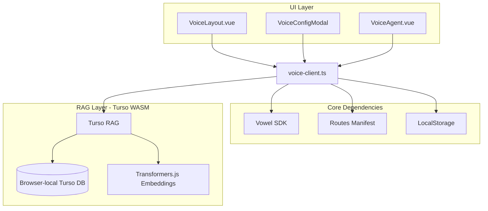

# Architecture

## System Overview

## Key Components

### VoiceLayout.vue

Custom VitePress theme layout that:
- Adds a "voweldocs" button to the navbar
- Shows voice configuration modal
- Mounts the voice agent widget
- Handles configuration state

### VoiceConfigModal.vue

Configuration UI supporting two modes:

- **Hosted (SaaS)**: Uses `appId` from [vowel.to](https://vowel.to) with hardcoded realtime URL
- **Self-Hosted**: Uses either:
  - `appId` + `url` (manual configuration)
  - JWT token with embedded URL (from environment variable)

### voice-client.ts

Core initialization logic:
- Reads credentials from localStorage
- Builds Vowel configuration based on mode
- Registers documentation-specific actions:
  - `searchKnowledgeBase` - **RAG-powered semantic search** over docs (Turso WASM)
  - `searchDocs` - Trigger DocSearch
  - `getCurrentPageInfo` - Read page structure
  - `copyCodeExample` - Copy code blocks
  - `jumpToSection` - Scroll to headings
  - `listSections` - Enumerate page sections
  - `showRelatedPages` - Find related docs
  - `openRagDebugChat` - Open debug panel to see STT/RAG results

### Routes Manifest

The `generate-routes-plugin.ts` Vite plugin scans all markdown files at build time and generates `routes-manifest.ts` with page paths and descriptions for voice navigation.

### RAG Knowledge Base (Turso WASM)

Powered by Turso WASM plus Transformers.js query embeddings in the browser:

- **Local semantic search** using Transformers.js embeddings
- **Pre-built index** loaded from `rag-index.yml` (generated at build time via `bun run build:rag`)
- **Zero cloud dependencies** - all processing happens client-side via WebAssembly
- **Instant answers** - the AI searches your docs before responding, ensuring factual, grounded answers
- **Debug visibility** - RAG debug chat shows exactly what the AI retrieved

## Agent Skills Reference

Implementation details for agents working with this codebase:

- **`voweldocs`** (`.agents/skills/voweldocs/`) - VitePress/Vue integration pattern, voice layout components
- **`rag-prebuild`** (`.agents/skills/rag-prebuild/`) - Pre-computed embedding generation with `build-rag.py`
- **`haven-local-rag`** (`.agents/skills/haven-local-rag/`) - Browser-based semantic search and local RAG pipeline background
