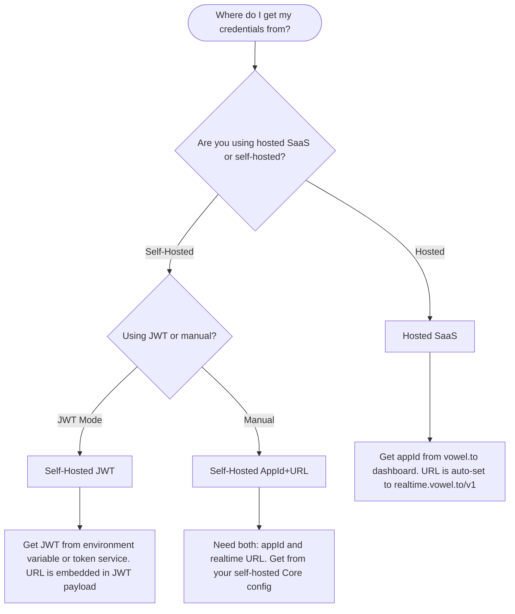

# Configuration

The voweldocs configuration modal allows end users to enter their own vowel credentials to enable voice-powered navigation on your documentation site.

## Two Configuration Modes

### Pre-configured Mode (No User Input Required)

If you provide credentials via environment variables at build time, the voice agent initializes automatically. Users can start speaking immediately without any configuration - the "voweldocs" button simply opens/closes the voice interface.

**Environment variables for pre-configuration:**
- `VITE_VOWEL_APP_ID` + `VITE_VOWEL_URL` (Hosted or Self-Hosted Manual)
- `VITE_VOWEL_JWT_TOKEN` + `VITE_VOWEL_USE_JWT=true` (Self-Hosted JWT)

This is ideal for:
- SaaS documentation where you want zero-friction voice access
- Internal documentation with a shared self-hosted instance
- Any site where you want to provide voice out-of-the-box

### User-Configured Mode (Bring Your Own Credentials)

If no credentials are pre-configured via environment variables, clicking the "voweldocs" button opens the configuration modal where users enter their own credentials:

#### Hosted Mode

For users connecting to the hosted vowel.to platform:

1. Sign up at [vowel.to](https://vowel.to/dashboard) and create an app in the dashboard
2. Copy the `appId` and paste it into the "App ID" field
3. The realtime URL is automatically set to `wss://realtime.vowel.to/v1`
4. Click "Save Configuration" to activate voice navigation

#### Self-Hosted (Manual)

For users running their own vowel infrastructure:

1. Enter the `appId` from your self-hosted Core configuration
2. Enter your custom realtime endpoint URL (e.g., `wss://your-domain.com/realtime`)
3. Save to connect to your private instance

#### Self-Hosted (JWT)

For production self-hosted deployments using JWT authentication:

1. Enable JWT mode to use a token with embedded URL
2. Enter or paste a JWT token (can be pre-filled via `VITE_VOWEL_JWT_TOKEN` env var)
3. The URL is extracted automatically from the JWT payload

::: info Storage
Credentials are stored in browser localStorage (per-user, per-device). The voice agent initializes immediately after saving.
:::

## Decision Tree

When setting up voweldocs for your documentation project, use this decision tree to determine which credentials you need:

## Environment Variables

Create a `.env` file (see `.env.example`):

| Variable | Mode | Purpose |
|----------|------|---------|
| `VITE_VOWEL_APP_ID` | Hosted | Your app ID from vowel.to |
| `VITE_VOWEL_URL` | Self-hosted | Your realtime endpoint (e.g., `wss://your-instance.com/realtime`) |
| `VITE_VOWEL_USE_JWT` | Self-hosted | Set to `true` to enable JWT mode |
| `VITE_VOWEL_JWT_TOKEN` | Self-hosted | JWT token with embedded URL |
| `VITE_VOWEL_DEBUG_RAG` | Dev only | Set to `true` to enable RAG debug UI (shows STT transcripts + search results) |

## URL Resolution Priority (Self-Hosted)

When using self-hosted mode, the realtime URL is resolved in this order:

1. **JWT payload** (`url`, `endpoint`, or `rtu` claim) - Highest priority
2. **Environment variable** (`VITE_VOWEL_URL`)
3. **Fallback placeholder** - Only used if neither above is set
