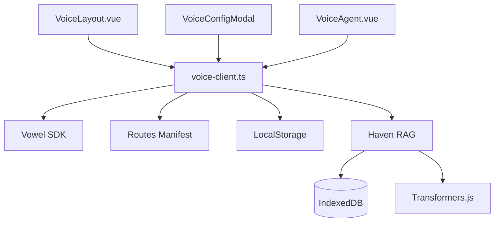

# voweldocs

Add voice-powered AI navigation to your documentation site. voweldocs is a reference implementation showing how to integrate the vowel client into any documentation platform.

## What is voweldocs?

**voweldocs** enables users to:

- **Navigate by voice** - "Take me to the installation guide"
- **Ask questions with RAG** - "What is Vowel?" with answers grounded in your docs
- **Interact with content** - "Copy the first code example"
- **Search documentation** - "Search for adapters" using VitePress DocSearch

## Architecture Overview



The system consists of UI components (VoiceLayout, VoiceConfigModal, VoiceAgent), core dependencies (Vowel SDK, routes manifest, localStorage), and a privacy-first RAG layer using Haven VectorDB with local embeddings.

## Documentation Sections

- [**Architecture**](./architecture) - System components, VoiceLayout, voice-client.ts, and RAG Knowledge Base
- [**Configuration**](./configuration) - Decision tree for choosing hosted vs self-hosted, environment variables, URL resolution
- [**RAG**](./rag) - Privacy-first retrieval-augmented generation with Haven VectorDB
- [**Integration**](./integration) - Step-by-step guide to add voweldocs to your documentation site
- [**Troubleshooting**](./troubleshooting) - Security considerations and common issues

## Quick Start

```bash
# Install dependencies
bun add @vowel.to/client @ricky0123/vad-web haven

# Generate RAG embeddings (pre-built index for AI answers)
bun run build:rag

# Full production build (includes routes + RAG + VitePress)
bun run docs:build
```

See the [Integration Guide](./integration) for complete setup instructions.

## Agent Skills

When working with voweldocs in Cursor/Claude, these agent skills provide detailed guidance:

- **`voweldocs`** - Main skill for voice-enabling documentation sites (VitePress/Vue pattern)
- **`rag-prebuild`** - Pre-build RAG embeddings using `scripts/build-rag.py`
- **`haven-local-rag`** - Work with Haven VectorDB, browser-based semantic search, and local RAG pipelines

Skills are located in `.agents/skills/` and provide context-aware assistance for specific tasks.
